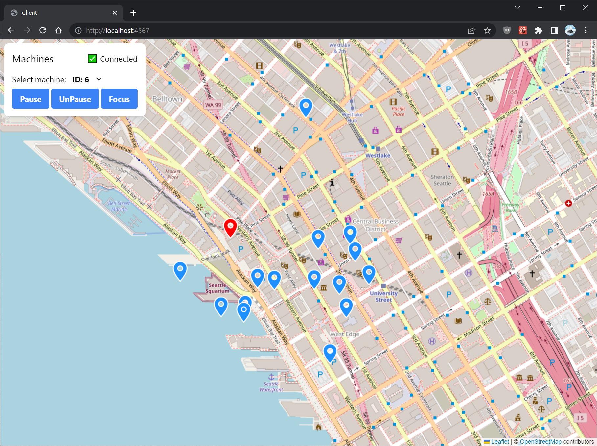

# aim-takehome

## overview

The project consists of three components:

1. Web client
2. GRPC server
3. Envoy proxy

The web client communicates with the GRPC server via the Envoy proxy. A proxy layer is required because browsers do not provide fine-grained transport APIs required by GRPC. Envoy is the proxy used in the [official docs](https://grpc.io/docs/platforms/web/basics/#configure-the-envoy-proxy).

All dependencies can be retrieved automatically given that you have some basic prerequisites installed. A single command will install dependencies and then start all three components locally in development mode. You can then navigate to the web client URL to see the project in action. See the next section for details.

## running

Dependencies: Node 16+, npm, Docker

1. Get pnpm: `npm install -g pnpm`
2. `pnpm start`
3. navigate to [http://localhost:4567](http://localhost:4567)

When you're done:

1. Stop the Envoy container using `pnpm stop-envoy`

## controls

- Drag to pan map, scroll/pinch to zoom
- Machine locations are displayed as pin icons
- Select a machine using the dropdown, or by clicking on its icon
- With a machine selected, use the buttons to perform actions

## notes on testing

There's no automated testing yet. Here are some things that could be tested:

- Start client and server, check that client shows "connected"
- A pin appears on the map for each distinct machine written to MachineStream
- When the server writes to MachineStream, a corresponding pin on the map moves
- Selecting a machine and clicking "(Un)Pause" causes the server to receive (Un)Pause RPC
- Clicking on a map pin selects the correct machine
- The client calls MachineStream again if the stream ends (reconnect)

## development

- The server and client support hot-reloading.
  - The client has hot module replacement via Parcel
  - The server will be recompiled and restarted when changes occur

## regenerating proto outputs

Dependencies: Python 3, `protoc` on path

1. `npm i -g protoc-gen-ts`
2. `cd proto`
3. `python generate.py`
